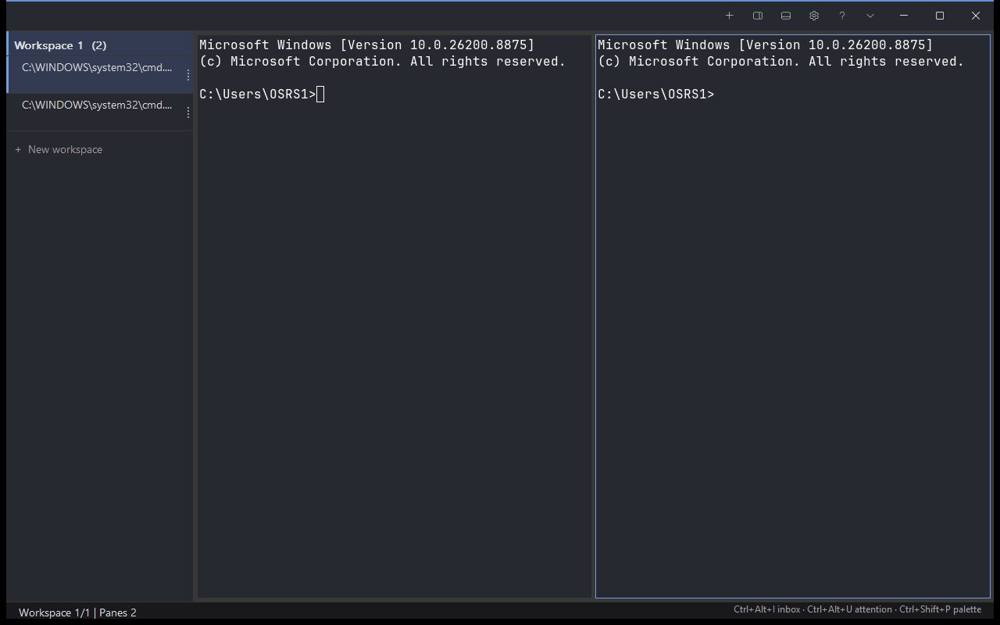

<p align="center">
  
</p>

<p align="center">
  <strong>A native Windows command center for parallel coding agents.</strong>
  <br />
  GPU terminal core · split workspaces · live agent state · local automation
</p>

<p align="center">
  <a href="https://github.com/soldforaloss/paramux/releases">Releases</a>
  ·
  <a href="docs/paramux/paramux-prd.md">Product requirements</a>
  ·
  <a href="docs/paramux/capability-parity.md">Capability parity</a>
  ·
  <a href="contrib/paramux/hooks/README.md">Agent hooks</a>
  ·
  <a href="HACKING.md">Development</a>
  ·
  <a href="SECURITY.md">Security</a>
</p>

---

<p align="center">
  
</p>

## What is Paramux?

Paramux is a native Windows terminal built for running Claude Code, Codex CLI,
Gemini CLI, OpenCode, and ordinary shells side by side. It combines the session
model of tmux, the agent-oriented workspace ideas popularized by cmux and wmux,
and a real GPU-rendered terminal instead of an xterm.js WebView.

Each pane is an independent ConPTY session. Tabs group related workspaces, while
the left sidebar answers the questions that matter when several agents are
running at once:

- Which pane needs me?
- Which agent finished or failed?
- What repository, branch, directory, and ports belong to this pane?
- How do I jump to it without cycling through every terminal?

Paramux is a fork of the native Windows work from
[winghostty](https://github.com/amanthanvi/winghostty) and retains Ghostty's
terminal, font, and OpenGL rendering core. Winghostty and Ghostty are technical
lineage and compatibility names; **Paramux is the product and executable.**

## What works today

- Native Win32 shell on Windows 10/11 with ConPTY and OpenGL 4.3 rendering.
- Independent panes, horizontal/vertical splits, tabs, drag-to-resize dividers,
  pane zoom, session restore, and native context menus.
- Always-visible split-right, split-down, and settings buttons with hover
  tooltips, plus zoom, equalize, and merge-panes actions in the menus.
- Drag-and-drop pane rearrangement: drag a sidebar row onto a pane edge to
  dock it there, onto a pane center (or another row) to swap, with a live
  translucent drop preview.
- Native settings window (Ctrl+, or the gear button) with a searchable theme
  picker showing live color swatches for every bundled theme, appearance and
  terminal preferences, and an Explorer-integration toggle — all persisted to
  the config file with comments preserved and applied live on Save.
- Optional "Open in Paramux" entry in the Explorer right-click menu for
  folders and drives (per-user registry, no admin).
- Clickable pane sidebar with title, working directory, git branch/dirty state,
  listening ports, and a consistent attention color.
- Four agent states: working, waiting, done, and error. The same color appears
  in the sidebar, tab strip, and pane ring.
- Windows toast notifications and taskbar attention for agent events.
- Hooks and fallbacks for Claude Code, Codex CLI, Gemini CLI, and OpenCode.
- Local control surface for listing windows, splitting panes, reading pane
  output, and setting notifications. Sensitive calls use a per-instance token.
- Rebindable Ghostty-style configuration plus Ghostty and Windows Terminal theme
  import.
- Portable packaging with `paramux.exe`, the console-friendly `paramux.com`
  launcher, and an idempotent user-PATH installer.
- CLI lifecycle management: `paramux install`, `uninstall [--purge]`, and
  checksum-verified in-place `update` from GitHub releases.

The current build is a public, unsigned prerelease. Signed installers, WinGet, and Scoop
distribution are not published yet; the portable build is the truthful install
path today.

## Try the current prerelease

The current test build is
[`v0.1.7`](https://github.com/soldforaloss/paramux/releases/tag/v0.1.7),
published 2026-07-20 for Windows x64:

- [`paramux-0.1.7-windows-x64-portable.zip`](https://github.com/soldforaloss/paramux/releases/download/v0.1.7/paramux-0.1.7-windows-x64-portable.zip)
- [`SHA256SUMS-windows-x64.txt`](https://github.com/soldforaloss/paramux/releases/download/v0.1.7/SHA256SUMS-windows-x64.txt)

This build is the foundation release — hardening, portability, and
reach. The **IPC pipe** rejects remote clients and pipe-name squatting
(token auth was already constant-time), malformed frames are
**fuzz-tested** in CI, and a **perf budget gate** fails the build if
CLI cold-start regresses past 250ms. **`session-name`** keeps
independent saved sessions per instance, **`paramux export-config`**
backs up your whole setup, **`update --rollback`** restores the
previous version from its `.old` window, and `paramux status` gains
**`--watch`**. Projects get a **layout template gallery**
(`docs/paramux/layouts/`), screen readers get a **live fleet summary**
on the window's UIA HelpText, high contrast overrides custom accent
colors, the hint strip is configurable, the HUD reports DPI/uptime/
window count, workspaces move up/down from the menu, and a
**telemetry design fence** documents that nothing is collected today.
It sits on top of
`v0.1.6`'s horizon features. Releases from
`v0.1.0-paramux.7` onward apply with `paramux update`
(`v0.1.0-paramux.4` remains a legacy test artifact).

1. Download both the portable ZIP and `SHA256SUMS-windows-x64.txt`.
2. Before extracting or running anything, compare the ZIP's digest with the
   release checksum:

```powershell
Get-FileHash .\paramux-0.1.7-windows-x64-portable.zip -Algorithm SHA256
Get-Content .\SHA256SUMS-windows-x64.txt
```

   Stop if the hashes do not match.
3. Extract the verified ZIP. Because this prerelease is unsigned, optionally
   confirm that status before running it:

```powershell
Get-AuthenticodeSignature .\paramux\paramux.exe |
  Select-Object Status, StatusMessage, SignerCertificate
```

4. Double-click `install-paramux.cmd` inside the extracted `paramux` folder.
   It adds that folder to your user `PATH` and clears the downloaded-file mark.
5. Open a new PowerShell or Command Prompt window and run:

```powershell
paramux
```

The CLI can manage its own lifecycle from there on:

```powershell
paramux update --check   # is a newer release available?
paramux update           # checksum-verified in-place update
paramux uninstall        # remove PATH/PARAMUX_HOME/Explorer entries
paramux uninstall --purge  # ... and delete %LOCALAPPDATA%\paramux
paramux install          # re-wire a moved folder (same as install-paramux.cmd)
```

To undo the PATH change with the script instead:

```powershell
.\install-paramux.ps1 -Remove
```

The prerelease is unsigned, so Explorer may show a SmartScreen warning. A GPU
and driver exposing OpenGL 4.3 or newer are required; the portable ZIP does not
bundle a software renderer.

## First five minutes

The visible title-bar controls are intentionally enough to get started:

- `+` opens a workspace.
- The two split buttons next to `+` create a pane to the right or below
  (hover any button for its shortcut).
- The gear opens Settings — pick a theme from the searchable swatch list,
  and Save applies it live.
- `▾` opens profiles, split directions, search, the command palette, and other
  workspace actions.
- Click any row in the left sidebar to focus that pane; drag a row onto a
  pane to rearrange (edges dock, the middle swaps).
- Drag the gutter between panes to resize them.
- Right-click a terminal or a sidebar row for copy/paste, search, splits,
  zoom, merge, and new-window actions.

Useful defaults:

| Action | Binding |
| --- | --- |
| New workspace | `Ctrl+Shift+T` |
| Split right / down | `Ctrl+Shift+O` / `Ctrl+Shift+E` |
| Focus previous / next pane | `Ctrl+Alt+[` / `Ctrl+Alt+]` |
| Recent workspace / pane (toggle) | `Ctrl+Alt+L` / `Ctrl+Alt+;` |
| Jump to newest agent notification | `Ctrl+Alt+U` |
| Attention inbox | `Ctrl+Alt+I` |
| Find in all panes | `Ctrl+Alt+F` |
| Attention digest | `Ctrl+Alt+D` |
| Health HUD | `Ctrl+Alt+H` |
| Always on top | `Ctrl+Alt+T` |
| Undo (close pane/workspace) | `Ctrl+Shift+Z` |
| Resize focused pane | `Ctrl+Alt+Shift+Arrow` |
| Next / previous workspace | `Ctrl+Tab` / `Ctrl+Shift+Tab` |
| Command palette | `Ctrl+Shift+P` |
| Find in scrollback | `Ctrl+Shift+F` |
| Copy / paste | `Ctrl+Shift+C` / `Ctrl+Shift+V` |
| Reload config | `Ctrl+Shift+,` |

See the effective keymap at any time:

```powershell
paramux list-keybinds
```

## Agent attention

Paramux injects `PARAMUX_SURFACE_ID` and `PARAMUX_TOKEN` into every pane so an
agent hook can address its own pane without guessing which window is active.
The included examples live in [`contrib/paramux/hooks/`](contrib/paramux/hooks/).

Manual smoke test from inside a pane:

```powershell
paramux notify --state=waiting "Waiting for approval"
paramux notify --state=done "Task complete"
paramux notify --state=error "Tests failed"
```

Supported states are `working`, `waiting`, `done`, and `error`. Plain
`paramux notify "message"` notifications default to `waiting`.

## Local automation

The control surface is local-only and uses Paramux's existing named-pipe
transport. Discovery is read-only; pane output and mutating actions require the
per-instance token written under `%LOCALAPPDATA%\paramux`.

```powershell
# Discover window, tab, and pane IDs.
paramux list-windows

# Split the focused pane.
paramux perform-action new_split:right

# Read the focused pane, or target an ID returned above.
paramux read-pane
paramux read-pane --surface-id=42

# Send exact text and a terminal key to a pane.
paramux send --surface-id=42 "npm test"
paramux send-key --surface-id=42 enter

# Target an agent-attention event explicitly.
paramux notify --surface-id=42 --state=waiting "Review needed"
```

The JSON discovery schema is `paramux.windows.v2`. Dedicated `send` and
`send-key` calls are bounded, UTF-8 validated, pane-targeted, and token-gated.
The generic `perform-action` allowlist still rejects terminal-write, file
helper, and crash actions.

## Configuration and themes

Paramux creates its user configuration at:

```text
%LOCALAPPDATA%\paramux\config.ghostty
```

The `.ghostty` extension and `share/ghostty` resources are retained for
compatibility with Ghostty's mature configuration and theme ecosystem.

```ini
font-family = JetBrains Mono
font-size = 12
theme = Dracula
```

```powershell
paramux show-config --default --docs | more
paramux list-themes
paramux import-theme "$env:LOCALAPPDATA\Packages\Microsoft.WindowsTerminal_8wekyb3d8bbwe\LocalState\settings.json"
```

## Build from source

Requirements:

- Windows 10 or 11
- Zig 0.15.2 or another supported Zig 0.15 patch release
- Visual Studio 2022 with the C++ workload and Windows SDK
- Git for Windows

```powershell
powershell -ExecutionPolicy Bypass -File scripts/fetch-zig-deps.ps1
zig build -Demit-exe=true
zig build test -Dtest-filter=<targeted-test-name>
```

Build outputs:

```text
zig-out\bin\paramux.exe
zig-out\bin\paramux.com
```

The shared Zig core lives under `src/`; the native application runtime is
`src/apprt/win32.zig`; packaging lives under `dist/windows/` and
`scripts/package-windows.ps1`.

## Product direction

The source-of-truth scope and acceptance criteria are in
[`docs/paramux/paramux-prd.md`](docs/paramux/paramux-prd.md). Paramux is moving
toward practical capability parity with cmux, tmux, and wmux while preserving a
native Windows feel. Compatibility means equivalent workflows where they make
sense on Windows—not blindly copying another product's UI or Unix-only internals.
The current source-backed matrix and gap order live in
[`docs/paramux/capability-parity.md`](docs/paramux/capability-parity.md).

Current priorities are:

1. Finish every user-facing Paramux identity surface and package verifier.
2. Make pane, tab, workspace, and attention workflows self-explanatory.
3. Close the remaining source-backed cmux/tmux/wmux workflow gaps.
4. Validate performance and interaction quality on real Windows GPUs.
5. Ship signed installer, WinGet, Scoop, x64, and ARM64 release paths.

## Privacy and security

Paramux does not send analytics. Crash dumps stay local under
`%LOCALAPPDATA%\paramux\crash` and may contain terminal or process memory, so
review them before sharing. The built-in updater is the only normal outbound
network path and talks to the Paramux GitHub releases API when enabled.

Please report security issues according to [SECURITY.md](SECURITY.md). Do not
include tokens, private terminal output, or crash-memory contents in public
reports.

## License and lineage

Paramux is MIT licensed. Ghostty's shared terminal core and the native Windows
work inherited from Winghostty remain under the same license; see
[LICENSE](LICENSE) and the Git history for attribution.
